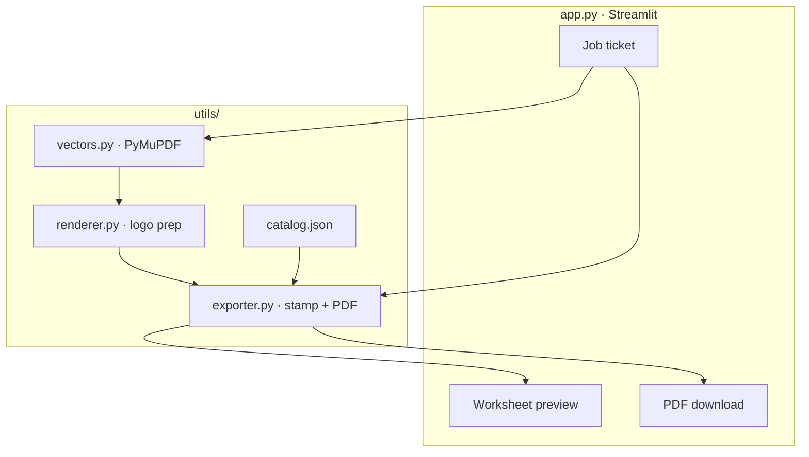
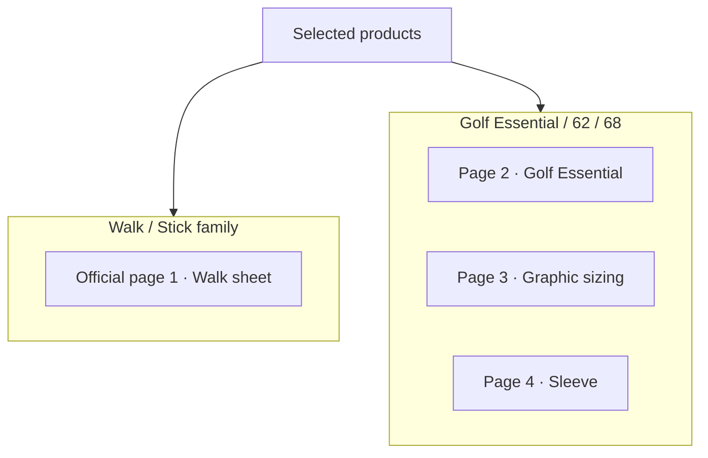
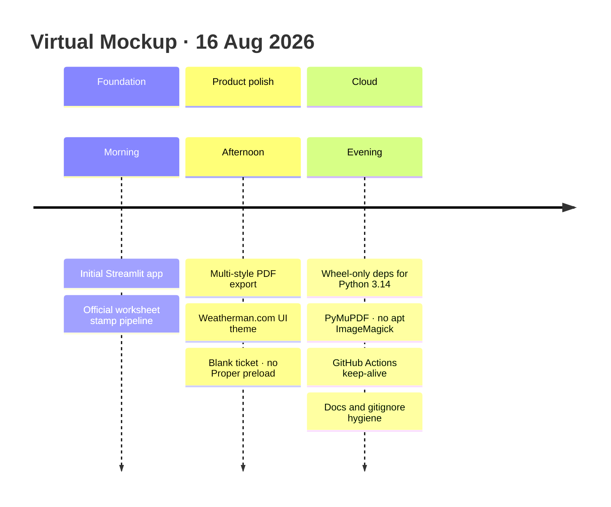

# Weatherman Virtual Mockup Creator

Internal Streamlit tool for Weatherman sales and operations. It stamps a client
logo onto the official production-worksheet pages and exports a multi-page PDF
proof that mirrors Weatherman production sheets (front, sizing, sleeve, and
related views).

**Live app:** [virtual-mockup on Streamlit Cloud](https://virtual-mockup-fe3z8kxueqz7xjjb8vvcnt.streamlit.app/)  
**Repo:** [mg22mex/virtual-mockup](https://github.com/mg22mex/virtual-mockup)

---

## Suggested GitHub description

> Internal Weatherman Streamlit app that stamps vector client logos onto official production worksheets and exports multi-page PDF proofs for Walk, Stick, and Golf styles.

**Topics (optional):** `streamlit` · `weatherman` · `umbrella` · `mockup` · `pdf` · `pillow` · `opencv`

---

## What it does

1. Operator fills a blank **job ticket** (client, styles, fabric, logo color, year).
2. Uploads **vector** artwork only: SVG, AI, CDR, PDF, EPS.
3. App clears the official sample marks on the worksheet rasters, recolors fabric
   where needed, and stamps the client logo into the mapped slots.
4. On-screen proof shows the official pages; **Generate** writes a PDF for download.

Supported style families include Walk / Stick-family pages and Golf Essential
(with graphic sizing and sleeve sheets when selected). Artwork bounds follow
Weatherman production standards (e.g. 21.6 cm × 10 cm Walk/Golf panels).

---

## Stack

| Layer | Choice |
|--------|--------|
| UI | Streamlit (`app.py`) |
| Imaging | Pillow, OpenCV (headless) |
| Vectors | PyMuPDF on Cloud; optional local `rsvg` / Ghostscript / Poppler / ImageMagick |
| PDF export | ReportLab (composes stamped page images) |
| Fonts | Vendored Liberation Sans under `assets/fonts/` |

Processing stays in `utils/`; UI stays in `app.py`. Do not rebuild worksheets from
scratch in ReportLab — stamp onto the official page templates in
`assets/templates/official/`.

---

## Project layout

```
app.py                      # Streamlit dashboard
requirements.txt            # Python deps (wheels-only for Cloud)
assets/
  catalog/catalog.json      # Fabrics, styles, logo colors
  fonts/                    # Liberation Sans for Cloud
  templates/official/       # Official worksheet page rasters
  templates/wm_mark.png     # App logo mark
utils/                      # Export, render, vectors, catalog
skills/                     # Lightweight job memory & asset log
scripts/keepalive.py        # Playwright wake for Community Cloud
.github/workflows/          # Keep-alive schedule
.streamlit/config.toml      # Weatherman.com-inspired UI theme
```

Local-only (gitignored): `.venv/`, `data/`, `output/`, `assets/logos/`, screen
recordings (`*.webm`, `Videocaptura*`), IDE workspaces (`*.code-workspace`),
Streamlit log dumps (`logs-*.txt`), and the large reference PDF.

---

## Run locally

```bash
python -m venv .venv
source .venv/bin/activate          # Windows: .venv\Scripts\activate
pip install -r requirements.txt
streamlit run app.py
```

Optional system tools (improves some vector edge cases locally):

- `rsvg-convert` (librsvg)
- Ghostscript (`gs`)
- Poppler (`pdftocairo`)
- ImageMagick (`magick`)

Cloud does **not** require these; it uses PyMuPDF from `requirements.txt`.

---

## Deploy on Streamlit Community Cloud

1. Push `main` to GitHub.
2. At [share.streamlit.io](https://share.streamlit.io), New app → this repo → `app.py`.
3. Prefer **Python 3.12** in Advanced settings if offered. If the platform
   provisions **3.14**, current `requirements.txt` is written for 3.14 wheels
   (`numpy>=2.3`, `--only-binary=:all:`).
4. Wait for `Uvicorn server started` / `Updated app!`.

### Dependencies note

`requirements.txt` forces **binary wheels only**. Compiling Pillow/numpy from
source fails on Cloud (no zlib/JPEG headers). Do not remove `--only-binary=:all:`
without adding apt build packages.

### Keep-awake

Workflow **Keep Streamlit awake** (`.github/workflows/keepalive.yml`) opens the
live URL with Playwright every **2 hours** so Community Cloud is less likely to
show “get this app back up.”

- Manual run: GitHub → **Actions** → **Keep Streamlit awake** → **Run workflow**
- Cadence: edit the `cron` in that YAML (`20 */2 * * *` = every 2 hours UTC)

Keep-alive reduces **sleep**; it does not speed up a full env rebuild after
dependency changes or a dashboard reboot.

---

## Operator notes

- Job ticket starts **blank** — no Proper demo defaults.
- Upload vector logos only (no PNG/JPG).
- Select products before fabric options appear.
- Fill required ticket fields (including worksheet year) before the proof builds.
- Walk + Golf Essential → multi-page PDF when both are selected.

---

## Architecture diagrams

### Operator pipeline


### Module layout



### Official page mapping



### Build timeline (16 Aug 2026)



The same diagrams and live metrics appear in the Streamlit UI under
**About this tool · diagrams, stats, timeline**.

---

## Development rules (short)

See `.cursorrules` for production constraints: keep exact panel mappings and
scale factors, keep UI decoupled from `utils/`, and keep generated proofs
aligned with official Front / Top / Sleeve / Flat layouts.
